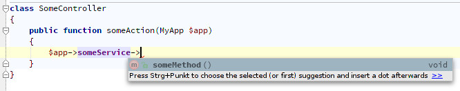

## Use a Dependency Injection Container

This framework will not force you to use a specific _Dependency Injection Container_.
There are a lot of useful DICs out there and you can choose one that you like.

The App object has only two methods that you need:

- setContainer($container)
- getContainer()

Here's an example that uses [Pimple](http://pimple.sensiolabs.org/):

```php
$container = new \Pimple\Container();

$container['someService'] = function () {
    return new SomeService();
};

$router = new \Line\Routing\Router($routes, $errorController);
$app = new \Line\App($router);

// set the container to make it available in all Controllers
$app->setContainer($container);

$app->run();
```

In the Controller you can now get the Container to access the services.

```php
public function someAction(App $app)
{
    $someService = $app->getContainer()['someService'];
}
```

## Extend the App to autocomple services.

If you want to use _autocompletion_ in your IDE, you can extend the App class.

```php
/**
 * @property SomeService $someService
 */
class MyApp extends \Line\App
{
    public function __get($name)
    {
        return $this->getContainer()[$name];
    }
}
```

Because of the magic `__get()` method and the `@property` comment you can now
use the autocompletion if your IDE supports it:



--------------------

[Back to overview](index.md)